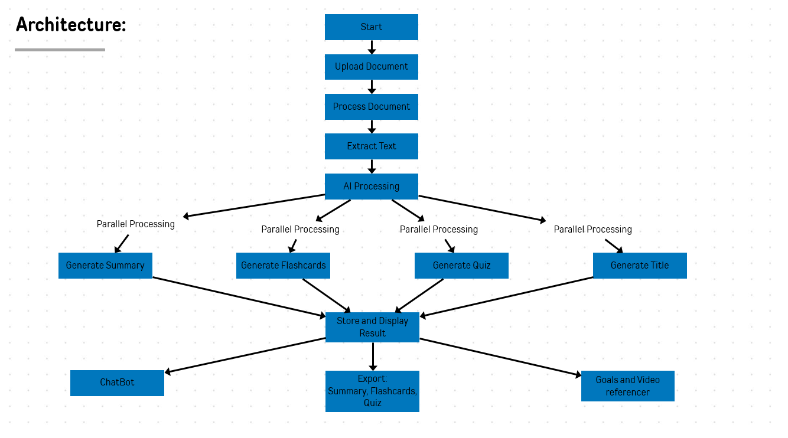
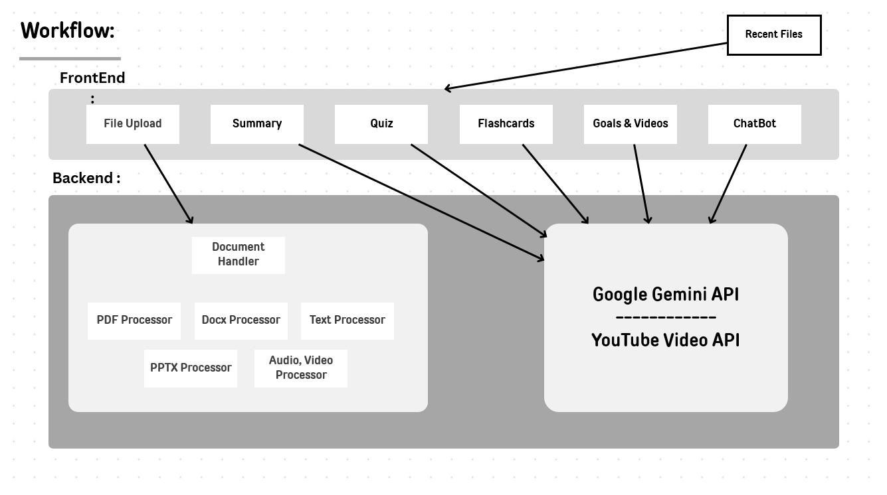

# 📚 Study Buddy - AI-Powered Study Assistant

**Study Buddy** is a Flask-based backend application designed to assist students and learners by processing educational content from various formats (📄 PDF, 📝 DOCX, 📊 PPTX, 🎙️ audio, 📹 video) and generating AI-powered study materials such as summaries, flashcards, quizzes, and more. It also includes an interactive chatbot for document-specific Q&A, goal-setting features, and YouTube integration for educational video suggestions.

---

## ✨ Features

- 📂 **Multi-Format Support**: Process PDF, DOCX, PPTX, audio, and video files.
- 🤖 **AI-Powered Content Generation**: Automatically generate summaries, flashcards, and quizzes using Google Gemini.
- 💬 **Interactive Chatbot**: Ask questions and get document-specific answers powered by Gemini.
- 🎯 **Goal Setting**: AI-generated study plans and task breakdowns.
- 🎥 **Video Integration**: Get curated educational video suggestions using YouTube Data API.
- 📤 **Export Functionality**: Export summaries, flashcards, and quizzes as Word documents.
- 🎙️ **Speech-to-Text**: Convert audio and video files into text for processing.

---

## 🛠️ Technology Stack

- **Backend Framework**: Flask (Python)
- **AI Integration**: Google Gemini API
- **File Processing Libraries**:
  - 📄 PyPDF (PDF)
  - 📝 python-docx (DOCX)
  - 📊 python-pptx (PPTX)
  - 🎙️ SpeechRecognition (audio/video)
- **APIs**:
  - 🤖 Google Gemini API (content generation and chatbot)
  - 🎥 YouTube Data API (video suggestions)
- **Data Storage**: JSON files in the filesystem
- **Hosting**: Free-tier cloud platforms (e.g., Heroku, AWS Free Tier)

---

## 🚀 Installation

### 🔹 Prerequisites

- 🐍 Python 3.8 or higher
- 🔥 Flask
- 🔑 Google Gemini API key
- 🔑 YouTube Data API key

### 🔹 Steps to Run the Project

1. **Clone the repository**:
   ```bash
   git clone https://github.com/Monishg2004/LearnBuddy.git
   cd study-helper
   ```

2. **Install dependencies**:
   ```bash
   pip install -r requirements.txt
   ```

3. **Set up environment variables**:
   - Create a `.env` file in the root directory.
   - Add your API keys:
     ```bash
     GEMINI_API_KEY=your_gemini_api_key
     YOUTUBE_API_KEY=your_youtube_api_key
     ```

4. **Run the Flask application**:
   ```bash
   python backend.py
   ```
   📍 The application will be running at `http://127.0.0.1:5000/`.

---

## 🎯 Usage

### 📂 File Upload
- Upload a file (PDF, DOCX, PPTX, audio, or video) via the `/upload` endpoint.
- The system will process the file, extract text, and generate study materials (summaries, flashcards, quizzes).

### 💬 Chatbot Interaction
- Start a chat session using the `/start_chat` endpoint.
- Ask questions related to the uploaded document using the `/get_response` endpoint.
- Clear the chat session using the `/clear_chat` endpoint.

### 🎯 Goal Setting
- Use the `/goal_advice` endpoint to get AI-generated study plans and task breakdowns.

### 🎥 Video Suggestions
- Use the `/search_videos` endpoint to get educational video suggestions based on the uploaded content.

### 📤 Export Study Materials
- Export summaries, flashcards, and quizzes as Word documents using the `/export_summary`, `/export_flashcards`, and `/export_quiz` endpoints.

---

## 🌐 API Endpoints

| Endpoint           | Method | Description                                      |
|---------------------|--------|--------------------------------------------------|
| `/upload`           | POST   | 📂 Upload and process a file.                    |
| `/start_chat`       | POST   | 💬 Start a chatbot session.                      |
| `/get_response`     | POST   | 🤖 Get a response from the chatbot.              |
| `/clear_chat`       | POST   | ❌ Clear the current chat session.               |
| `/goal_advice`      | POST   | 🎯 Get AI-generated study plans.                 |
| `/search_videos`    | POST   | 🎥 Get educational video suggestions.            |
| `/export_summary`   | GET    | 📜 Export summary as a Word document.           |
| `/export_flashcards`| GET    | 🃏 Export flashcards as a Word document.         |
| `/export_quiz`      | GET    | ❓ Export quiz as a Word document.               |

---

## 🏗️ Architecture Diagram



## 🔄 Workflow Diagram



## 🎥 Project Demonstration Video

🔗 [Watch the Project Video](https://drive.google.com/file/d/1Y-rODxyrovF_rH5SSLAg3NlzZi45oYzf/view?usp=drive_link)

---

Enhance your study experience with **Study Buddy**! 🚀📚

